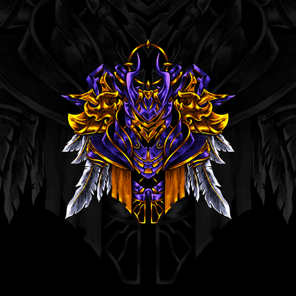
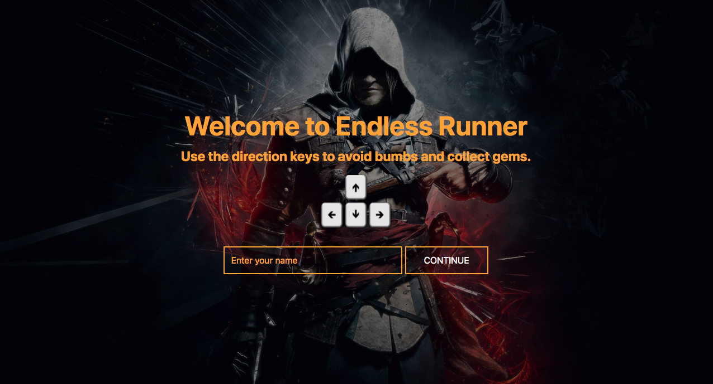
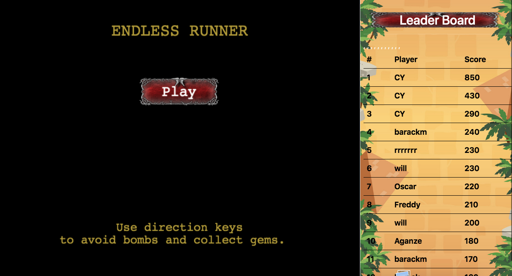
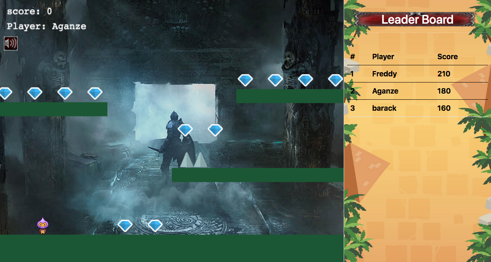
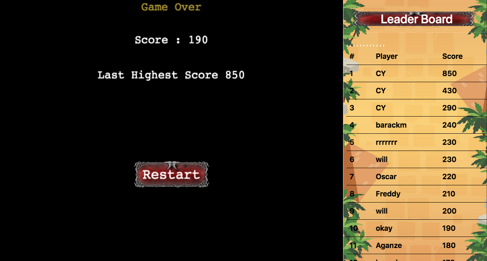

# Endless Runner

> Endless Runner is a game built in JavaScript characterized as an action game, linear in design with no end, without pauses or breaks for rest, and no stages or changing levels. It has one continuous level. The game's difficulty starts slow and easy.

## 📝 Contents

<a href="#with">Built with</a>&nbsp;&nbsp;&nbsp;|&nbsp;&nbsp;&nbsp;
<a href="#sc">Screenshot</a>&nbsp;&nbsp;&nbsp;|&nbsp;&nbsp;&nbsp;
<a href="#start">Getting started</a>&nbsp;&nbsp;&nbsp;|&nbsp;&nbsp;&nbsp;
<a href="#play">Game Instructions</a>&nbsp;&nbsp;&nbsp;|&nbsp;&nbsp;&nbsp;
<a href="#demo">Live Demo Link</a>&nbsp;&nbsp;&nbsp;|&nbsp;&nbsp;&nbsp;
<a href="#author">Author</a>

## Built With 

- Javascript
- Phaser3
- CSS
- Webpack

## Screenshots 

## Getting Started 

**To get the local copy of the project up and running you will need to run the following commands on your terminal:**

`git clone https://github.com/barackm/js-endless-runner-game`

To install all the available dependecies run:
`npm install`

To bundle and transpile the javascript code using webpack run:
`npm run build` for production, or:
`npm start` for development.

Now you can open up the index.html file (located in the build directory in chrome) to see the result.

## Game Instructions 

    The main objective of the game is to collect as many gems as possible and have the best score by avoiding bombs.

This is the Player, He can move at all positions.

1. Enter your name For tracking the score

2. Click on Play To start the Game

3. Use the down arrow key to go down

4. Use the left arrow key to go left
5. Use the right arrow key to go right

6. Collect Gems

7. If you fail the game you can either Restart or exit

## Demo Link 

[Demo](https://objective-lewin-3b30a9.netlify.app/)

## Run the tests

To run the tests that are located in the spec folder just run `npm test`

## Authors 

👤 **Barack Mukelenga**

- GitHub: [@barackm](https://github.com/barackm)
- Twitter: [@BarackMukelenga](https://twitter.com/BarackMukelenga)
- LinkedIn: [Baraka Mukelenga](https://www.linkedin.com/in/baraka-mukelenga/)

## 🤝 Contributing

Contributions, issues, and feature requests are welcome!

Feel free to check the [issues page](https://github.com/barackm/js-endless-runner-game/issues).

## Show your support

Give a ⭐️ if you like this project!❤️❤️❤️

## Acknowledgments

- Microverse

## License

The MIT License (MIT)

Copyright (c) 2021 Baraka Mukelenga
